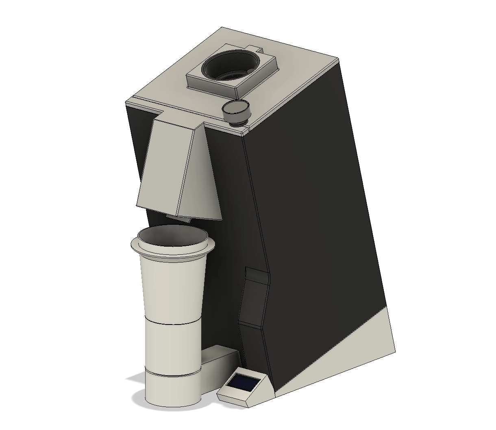

# Coffee grinder smart scale

  

This is the code and 3d model for the Coffee grinder smart scale. It add a scale to a Eureka Mignon coffee grinder to grind an exact dose of coffee.

The code and 3d model are not "production ready" and will likely not be perfect for your usage. You should look inside each file to customize the values to your liking (dosing cup weight + grinding weight + loadcell scale would be the most important).

More info: https://besson.co/projects/coffee-grinder-smart-scale
